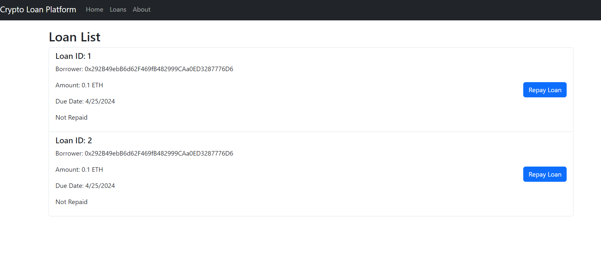

# Crypto Loan Platform Frontend

[](https://opensource.org/licenses/MIT)


## Table of Contents

- [Crypto Loan Platform Frontend](#crypto-loan-platform-frontend)
  - [Table of Contents](#table-of-contents)
  - [Description](#description)
  - [Technology](#technology)
  - [Installation](#installation)
  - [Tools and Libraries](#tools-and-libraries)
  - [Usage](#usage)
  - [Contribution](#contribution)
  - [Contact](#contact)
  - [License](#license)

## Description

The Crypto Loan Platform is a decentralized application built on Ethereum that allows users to secure loans backed by cryptocurrency. This frontend component provides an interactive user interface, enabling users to easily manage their loans and repayments through smart contracts without relying on centralized financial institutions.

## Technology

- **React**: For building the user interface.
- **Ethers.js**: A library to interact with the Ethereum blockchain.
- **Bootstrap**: For styling the application.
- **MetaMask**: As the Ethereum wallet provider.

  
*Crypto Loan Platform Interface*

## Installation

To run this project, follow these steps:

1. **Clone the repository**:
   ```bash
   git clone https://github.com/blockchaincyberpunk1/crypto-loan-platform-frontend.git
   cd crypto-loan-platform-frontend
   ```
2. **Install dependencies**:
   ```bash
   npm install
   ```
3. **Run the application**:
    ```bash
    npm start
    ```


## Tools and Libraries

- **React**: JavaScript library for building user interfaces.
- **ethers.js**: A complete Ethereum wallet implementation and utilities in JavaScript (and TypeScript).
- **Bootstrap**: Extensive list of components and Bundled Javascript plugins.


## Usage
 
To use the application:

1. Ensure MetaMask is installed and logged in.
2. Visit the application URL (usually http://localhost:3000).
3. Interact with the application to manage your loans, including creating new loans, viewing existing loans, and repaying loans.


## Contribution
 
Contributions are welcome! Please feel free to submit any issues or pull requests.


## Contact

Feel free to reach out to me on my email:
thepolyglot8@gmail.com


## License

[](https://opensource.org/license/MIT)

